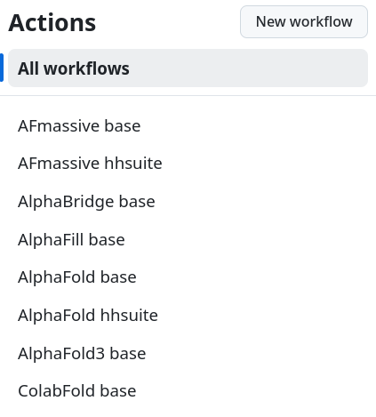
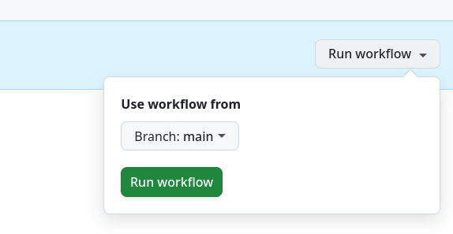

# proteinfold-containers

This repository allows the build of docker container needed by the [proteinfold pipeline](https://github.com/bioinfo-pf-curie/proteinfold). It builds the docker containers using GitHub Actions and pushes the containers on the [4geniac/proteinfold](https://hub.docker.com/r/4geniac/proteinfold) on Docker Hub.

We describe here how to add a new tool to the [proteinfold pipeline](https://github.com/bioinfo-pf-curie/proteinfold).

## Add a new tool 

### Create a git submodule with the tool version

For example, if you want to use the `openfold` version `v2.1.0`, you have to perform the following steps:

```
# Add the tool as a git submodule
git submodule add https://github.com/aqlaboratory/openfold.git modules/openfold
cd modules/openfold

# Checkout the version you want to use
git checkout v.2.1.0

# Push you modifications
cd ../..
git add modules/openfold .gitmodules
git commit -m "[ADD] submodule OpenFold v.2.1.0 (Issue #1)"
git push origin
```


### Create the GitHub Actions workflow

Then, you have to define a workflow for the new tool. You can capilize on an exiting workflow:

```
cd .github/workflows
cp alphafold3-base.yml openfold-base.yml
```

Edit the file `openfold-base.yml` and modify the following variables:

- name
- run-name
- TOOL_NAME

Possibly, additional modification maybe required.

Commit and push the `openfold-base.yml` file.

###  Create and add the Dockerfile

You have to create the `recipes/docker/openfold-v.2.1.0-base.Dockerfile`. Use the following naming convention: `TOOL_NAME-VERSION-base.Dockerfile`.


## Launch the GitHub actions

Connect on GitHub:

- click on 'Actions'.
- click on the workflow you want to launch
- click on the button `Run workflow`, and again on the green button with the same name





One completed, the `openfold-v.2.1.0-base` tag will be available in [4geniac/proteinfold](https://hub.docker.com/r/4geniac/proteinfold) on Docker Hub.
